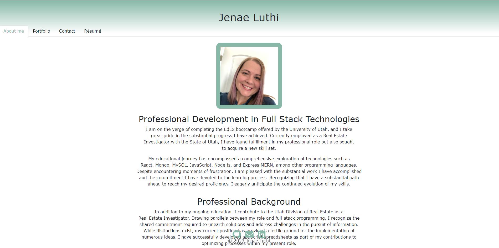
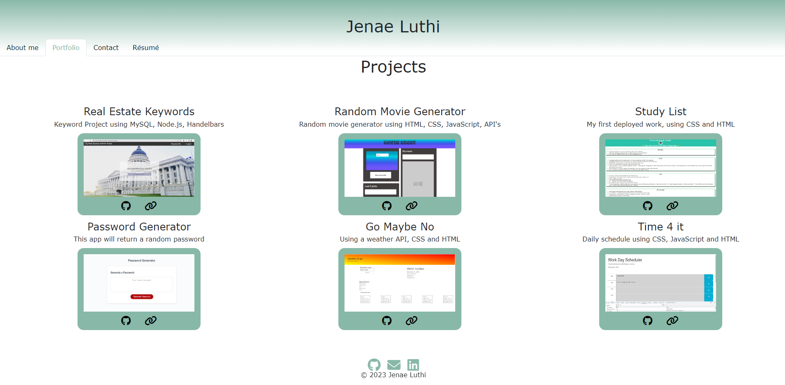
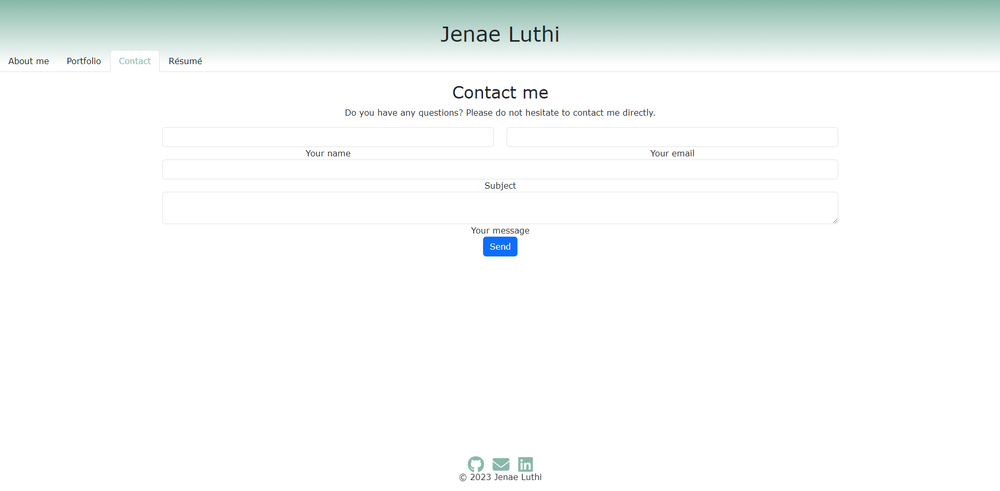
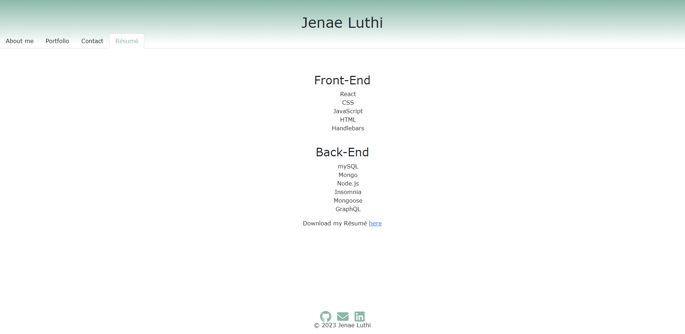

# Jenae Luthi 
 https://github.com/Jelu113/JenaeLuthi  
 https://snazzy-blini-9ca138.netlify.app
 ## Table of Contents
-[Description](#description)  

-[Usage](#usage)  
-[Credits](#credits)  

 ## Description

 I needed to update my portfolio to showcase my newly developed skills and determination to complete projects.
 
 I learned React, and how to deploy on Netlify. I also had to learn how to use components properly and I think this shows my abilities with React and learning new techniques The application itself shows competency in these areas and the Portfolio page shows the progress I have made. 

 I would like to remove the contact tab and just refer to the icon at the bottom that links to outlook.  I think the contact form is more of a novelty and not practical. 

## Usage
The About page is the homepage. It tells a little about me and has a picture of me. 

The Portfolio page, showcases a few of the deployed projects I have done throughout the course. 

The contact page holds a form, for someone to fill out and send to contact me.  

The resume page has a list of some of the skills I have learned and a link to download my resume. The footer has clickable links to my github, a way to email me, and a link to my linked in profile. 

## Credits
I had help from a tutor and worked on the challenge with 2 of my class mates that were also working on theirs. I used bootstrap and they were using Bulma. We would work independently and then when we would get stuck we would ask advice from the others.  JJ Saoit https://github.com/jensenjamessaoit and Salvador Mejia https://github.com/MrPolkadot. 

